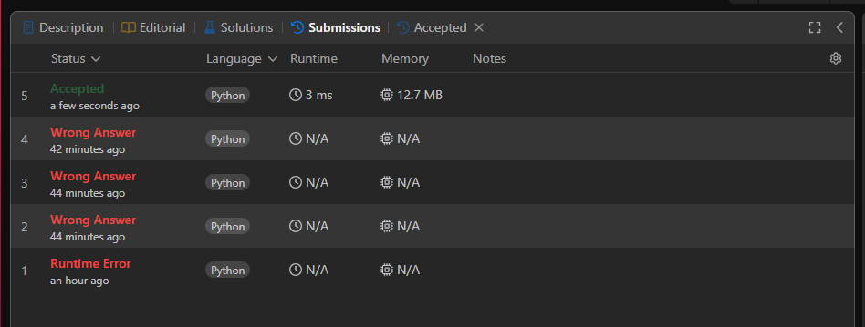
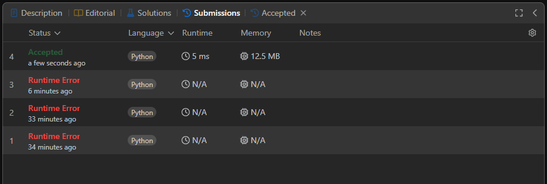
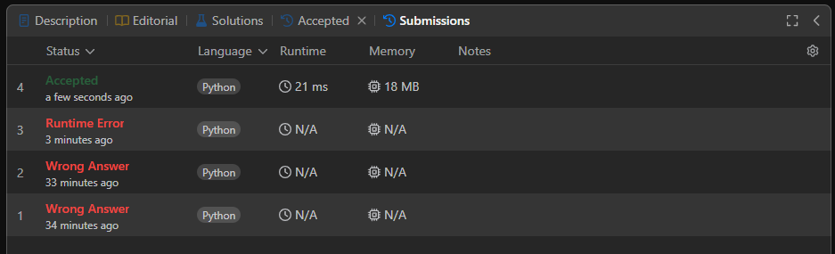
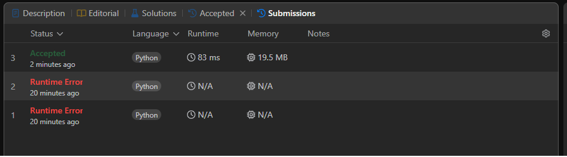

# D-C-59_LeetCode_Problems

**Conteúdo da Disciplina**: Dividir e Conquistar 

## Alunos
|Matrícula | Aluno |
| -- | -- |
| 20/0043030  |  Renann de Oliveira Gomes |

## Sobre 
Repos. inicial: https://github.com/NyndoND/D-C-59_LeetCode_Problems
Resolução de exercício do LeetCode, alguns exercício possuem scripts no final para poderem sr executados localmente sem a necessidade de testar no LeetCode

[Apresentação dos Problemas Resolvidos](https://www.youtube.com/watch?v=YMWz2BpThz8) 

## Screenshots

### 4. Median of Two Sorted Arrays

### 23. Merge k Sorted Lists

## 43. Multiply Strings

## 775. Global and Local Inversions

## Instalação 
**Linguagem**: Python 

Python instalado localmente ou acesso a plataforma LeetCode

## Uso 
É possível executar o código localmente ou copiando apenas a classe "Solution" e rodar na plataforma do LeetCode

